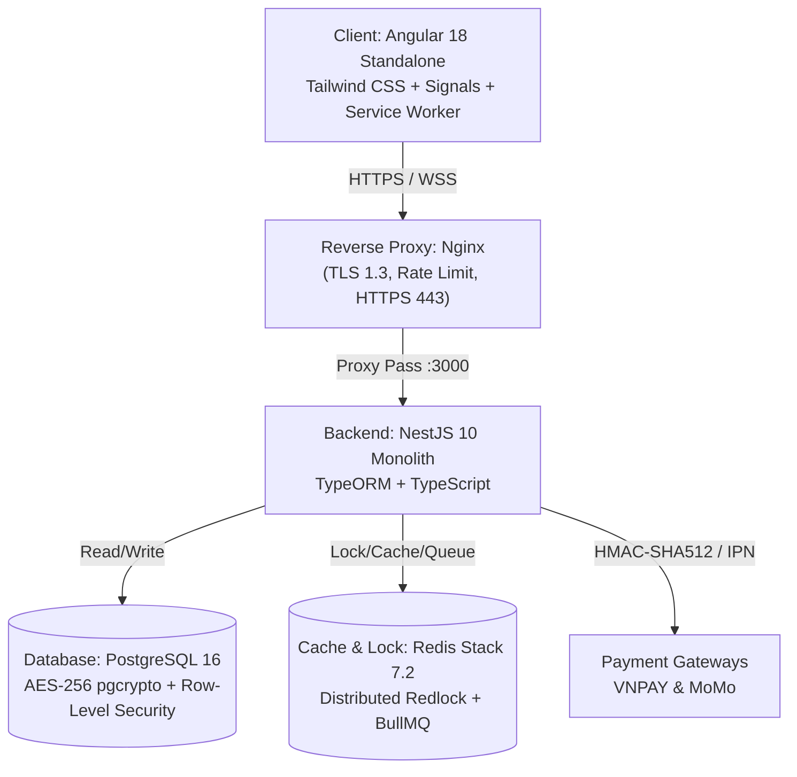

# 🏥 E-HEALTHCARE PORTAL (Monorepo)

> **Hệ thống Quản lý Khám chữa bệnh & Đặt lịch Khám thông minh Đa phân hệ**  
> Tuân thủ Thông tư 46/2018/TT-BYT (Hồ sơ bệnh án điện tử), Nghị định 13/2023/NĐ-CP (Bảo vệ dữ liệu cá nhân) và tiêu chuẩn an toàn thông tin y tế OWASP Top 10.

[](https://github.com/lecuong2512/E-healthcare/actions)
[](LICENSE)
[](https://angular.dev/)
[](https://nestjs.com/)
[](https://www.postgresql.org/)
[](https://redis.io/)

---

## 📑 Mục lục

1. [Giới thiệu dự án](#1-giới-thiệu-dự-án)
2. [Kiến trúc hệ thống & Công nghệ (Tech Stack)](#2-kiến-trúc-hệ-thống--công-nghệ-tech-stack)
3. [Cấu trúc thư mục Monorepo](#3-cấu-trúc-thư-mục-monorepo)
4. [Các phân hệ nghiệp vụ & Tài khoản kiểm thử (Demo Accounts)](#4-các-phân-hệ-nghiệp-vụ--tài-khoản-kiểm-thử-demo-accounts)
5. [Yêu cầu môi trường & Cài đặt (Prerequisites & Setup)](#5-yêu-cầu-môi-trường--cài-đặt-prerequisites--setup)
6. [Cấu hình biến môi trường (`.env`)](#6-cấu-hình-biến-môi-trường-env)
7. [Khởi chạy hệ thống (Local Development)](#7-khởi-chạy-hệ-thống-local-development)
8. [Hướng dẫn kiểm thử cổng thanh toán Sandbox (Cách 1 & Cách 2)](#8-hướng-dẫn-kiểm-thử-cổng-thanh-toán-sandbox-cách-1--cách-2)
9. [Kiểm toán an ninh, Mã hóa dữ liệu y tế & Phục hồi thảm họa](#9-kiểm-toán-an-ninh-mã-hóa-dữ-liệu-y-tế--phục-hồi-thảm-họa)
10. [Kiểm thử tự động & CI/CD Pipeline](#10-kiểm-thử-tự-động--cicd-pipeline)
11. [Quy chuẩn đóng góp mã nguồn (Gitflow & Conventional Commits)](#11-quy-chuẩn-đóng-góp-mã-nguồn-gitflow--conventional-commits)
12. [Bản quyền (License)](#12-bản-quyền-license)

---

## 1. Giới thiệu dự án

**E-Healthcare Portal** là giải pháp phần mềm tổng thể cho phòng khám và bệnh viện đa khoa số hóa toàn diện quy trình y tế:
- **Bệnh nhân (Patient Portal):** Tìm kiếm bác sĩ chuyên khoa, đặt lịch khám 4 bước theo khung giờ (slot), thanh toán trực tuyến qua VNPAY / MoMo, khai báo hồ sơ sức khỏe cá nhân (PHR), theo dõi lịch sử khám, nhận thông báo đẩy Web Push và tải đơn thuốc điện tử PDF có chữ ký số xác thực QR.
- **Bác sĩ (Doctor Portal):** Quản lý ca trực linh hoạt, buồng khám lâm sàng số hóa với chẩn đoán ICD-10, kê đơn thuốc tự động kiểm tra tương tác thuốc/dị ứng, tạo phụ lục bệnh án (Addendum) theo Thông tư 46/2018/TT-BYT khi hồ sơ khóa sau 24h.
- **Lễ tân (Reception Desk):** Tiếp đón check-in bằng mã QR tại quầy trong 5 giây, thu viện phí tại chỗ (Pay at clinic), in phiếu khám nhiệt POS K80 / hóa đơn A5, bảng gọi số sảnh chờ Smart TV chuyên dụng với điều hướng 2 chiều.
- **Quản trị viên (Admin Portal):** Dashboard KPI doanh thu & công suất buồng khám thời gian thực, quản lý nhân sự y bác sĩ, danh mục thuốc & dịch vụ, tra cứu nhật ký kiểm toán an ninh bất biến (Immutable Audit Logs).

---

## 2. Kiến trúc hệ thống & Công nghệ (Tech Stack)



| Tầng | Công nghệ / Thư viện | Vai trò |
| :--- | :--- | :--- |
| **Frontend** | Angular 18 (Standalone Components, Signals) | Giao diện người dùng Reactive, không dùng NgModules |
| | Tailwind CSS, ng-zorro-antd | Thiết kế chuẩn Design System y tế, responsive đa thiết bị |
| | Service Worker (`sw.js`) | Kênh thông báo đẩy native (Web Push API) |
| **Backend** | NestJS 10, Express, TypeScript | RESTful API, WebSocket Gateway, kiến trúc Module hóa |
| | TypeORM 0.3 | Database ORM, quản lý migrations tự động |
| | BullMQ, @nestjs/schedule | Hàng đợi tác vụ ngầm (Queue Workers) & Cron nhắc lịch |
| | PDFKit, QRCode, web-push | Sinh đơn thuốc PDF có mã QR, gửi Web Push VAPID |
| **Data & Infra**| PostgreSQL 16 Alpine | Lưu trữ cơ sở dữ liệu quan hệ, mã hóa dữ liệu y tế tĩnh |
| | Redis Stack 7.2 | Distributed Lock (Redlock), Token Blacklist, Cache |
| | Docker & Docker Compose | Container hóa toàn bộ hệ thống phát triển và triển khai |
| | Nginx | Reverse Proxy, SSL Offloading, chống DDoS rate limit |

---

## 3. Cấu trúc thư mục Monorepo

```text
E-healthcare/
├── client/                     # Phân hệ Frontend (Angular 18 Standalone)
│   ├── public/                 # Assets tĩnh & Service Worker (sw.js)
│   ├── src/
│   │   ├── app/
│   │   │   ├── core/           # Guards, Interceptors, Services dùng chung
│   │   │   ├── features/       # 4 phân hệ: patient, doctor, receptionist, admin
│   │   │   └── shared/         # Reusable UI Components (Navbar, Buttons, Modals)
│   │   └── styles/             # Global styles, Tailwind, SCSS TV Queue Board
│   └── package.json
│
├── server/                     # Phân hệ Backend (NestJS 10)
│   ├── src/
│   │   ├── common/             # Guards, Decorators, Redis Service, Filters
│   │   ├── config/             # Environment, Database, Configuration
│   │   ├── database/           # TypeORM Entities & 35+ Database Migrations
│   │   └── modules/            # Auth, User, Doctor, Booking, Clinical, Payment...
│   ├── scripts/                # Seeding data demo, QA test accounts
│   └── package.json
│
├── shared/                     # Thư viện dùng chung (Workspace @ehealth/shared)
│   └── src/
│       ├── enums/              # Role, AppointmentStatus, Gender, PaymentMethod...
│       ├── interfaces/         # PhrProfile, CurrentUser, DoctorView, AuditLog...
│       └── constants/          # Queue Socket constants, Shift constants
│
├── docs/                       # Tài liệu kỹ thuật, SRS, Kế hoạch, Sổ tay QA
│   ├── ke-hoach-bo-sung-tasks-srs.md
│   ├── so-tay-tong-hop-qa-srs-va-quy-chuan-du-an.md
│   └── runbooks/               # Hướng dẫn bảo mật, pgBackRest, Audit Logs
│
├── docker-compose.yml          # Cấu hình cụm dịch vụ: Postgres, Redis, Nginx
├── .env.example                # Bản mẫu khai báo biến môi trường chuẩn
├── LICENSE                     # Bản quyền phần mềm mã nguồn mở MIT
└── README.md                   # Tài liệu hướng dẫn sử dụng chính thức
```

---

## 4. Các phân hệ nghiệp vụ & Tài khoản kiểm thử (Demo Accounts)

Hệ thống tích hợp sẵn kịch bản kiểm thử với 4 tài khoản định danh tương ứng 4 vai trò chính:

| Vai trò | Tài khoản đăng nhập (Email / SĐT) | Mật khẩu mặc định | Phân hệ truy cập & Tính năng chính |
| :--- | :--- | :---: | :--- |
| **Bệnh nhân**<br>`ROLE_PATIENT` | `patient@ehealth.local`<br>`0901234001` | `Pass1234!` | • Đặt lịch khám 4 bước (`/patient/doctor-search`)<br>• Thanh toán Sandbox (`/patient/payment-result`)<br>• Hồ sơ PHR & Upload avatar (`/patient/profile`)<br>• Lịch sử khám & Tải đơn PDF (`/patient/history`) |
| **Bác sĩ**<br>`ROLE_DOCTOR` | `doctor@ehealth.local`<br>`0901234002` | `Pass1234!` | • Hàng đợi khám bệnh buồng khám (`/doctor/queue`)<br>• Chẩn đoán ICD-10 & Kê đơn thuốc điện tử<br>• Cấu hình ca trực & Giờ khám (`/doctor/schedule`) |
| **Lễ tân**<br>`ROLE_RECEPTIONIST`| `receptionist@ehealth.local`<br>`0901234003` | `Pass1234!` | • Bàn tiếp đón check-in QR (`/receptionist/checkin`)<br>• Tiếp nhận đặt lịch vãng lai (`/receptionist/walkin`)<br>• Bảng gọi số sảnh chờ Smart TV (`/receptionist/queue-board`) |
| **Quản trị viên**<br>`ROLE_ADMIN` | `admin@ehealth.local`<br>`0901234004` | `Pass1234!` | • Dashboard KPI thời gian thực (`/admin/dashboard`)<br>• Danh mục thuốc & Dịch vụ y tế (`/admin/catalogs`)<br>• Quản lý nhân sự & Bác sĩ (`/admin/staff`)<br>• Tra cứu nhật ký kiểm toán (`/admin/audit-logs`) |

---

## 5. Yêu cầu môi trường & Cài đặt (Prerequisites & Setup)

### Yêu cầu phần mềm
- **Node.js**: Phiên bản `v20.x` hoặc `v22.x` (LTS khuyến nghị).
- **NPM**: Phiên bản `10.x` trở lên (hỗ trợ npm workspaces).
- **Docker & Docker Compose**: Để chạy PostgreSQL 16 và Redis Stack.
- **Git**: Quản lý phiên bản mã nguồn.

### Cài đặt dependencies
Clone mã nguồn và cài đặt dependencies cho toàn bộ monorepo tại thư mục gốc:

```bash
git clone https://github.com/lecuong2512/E-healthcare.git
cd E-healthcare

# Cài đặt toàn bộ workspaces (root, client, server, shared)
npm install
```

---

## 6. Cấu hình biến môi trường (`.env`)

Sao chép file cấu hình mẫu từ `.env.example` sang `.env`:

```bash
cp .env.example .env
```

### Các thông số quan trọng cần lưu ý:
1. **Khóa mã hóa dữ liệu y tế tĩnh (`MEDICAL_DATA_ENCRYPTION_KEY`):**  
   Bắt buộc phải có đúng 64 ký tự hex ngẫu nhiên (chuẩn AES-256). Tạo nhanh bằng lệnh:
   - **Trên PowerShell (Windows):**
     ```powershell
     [Convert]::ToHexString([Security.Cryptography.RandomNumberGenerator]::GetBytes(32)).ToLowerInvariant()
     ```
   - **Trên Linux / macOS:**
     ```bash
     openssl rand -hex 32
     ```
2. **Cấu hình thanh toán thử nghiệm (Sandbox):**
   ```dotenv
   PAYMENT_ENABLED=true
   PAYMENT_ENV=sandbox
   PAYMENT_TIMEOUT_SECONDS=600
   ```

---

## 7. Khởi chạy hệ thống (Local Development)

### Bước 1: Khởi động Docker Containers (Cơ sở dữ liệu & Cache)
Tại thư mục gốc của dự án, chạy lệnh:

```bash
docker compose up -d
```
> Kiểm tra các cổng hoạt động: PostgreSQL (`5432`), Redis (`6379`), RedisInsight (`8001`).

### Bước 2: Chạy Database Migrations & Khởi tạo tài khoản Test
Thực thi các migrations TypeORM và nạp dữ liệu mẫu:

```bash
# Thực thi migrations
npm run migration:run --workspace=@ehealth/server

# Nạp 4 tài khoản kiểm thử chuẩn QA (Bệnh nhân, Bác sĩ, Lễ tân, Admin)
npx ts-node server/scripts/seed-qa-accounts.ts
```

### Bước 3: Khởi chạy Backend API (NestJS)
```bash
npm run start:dev --workspace=@ehealth/server
```
> Backend API hoạt động tại: **`http://localhost:3000`** (Swagger docs: `http://localhost:3000/api/docs`).

### Bước 4: Khởi chạy Frontend Web Client (Angular 18)
Mở một cửa sổ dòng lệnh mới và chạy:

```bash
npm run start --workspace=ehealth-web-client
```
> Ứng dụng Web hoạt động tại: **`http://localhost:4200`**.

---

## 8. Hướng dẫn kiểm thử cổng thanh toán Sandbox (Cách 1 & Cách 2)

Nhằm đảm bảo quá trình kiểm thử luồng đặt lịch và thanh toán diễn ra **100% trơn tru, hoàn toàn không mất tiền thật và không cần gỡ ứng dụng di động cá nhân**, dự án chuẩn hóa 2 phương án kiểm thử:

### Cách 1: Kiểm thử MoMo Sandbox trên Web Portal (Không cần App điện thoại) ⭐ *Tối ưu cho MoMo*

Khi bệnh nhân đặt lịch và chọn phương thức thanh toán **Ví MoMo**:
1. Hệ thống chuyển hướng sang cổng thanh toán của MoMo tại `https://test-payment.momo.vn/...`
2. **Không cần quét mã QR bằng điện thoại.** Trên màn hình web, bạn chọn tab **"Thanh toán qua số điện thoại / Thẻ"** hoặc **"Đăng nhập ví MoMo"**.
3. Nhập số điện thoại tài khoản test MoMo (hoặc số điện thoại đăng ký sandbox).
4. Nhập mã OTP test mặc định: **`123456`**.
5. Bấm **Xác nhận thanh toán**:
   - Hệ thống MoMo Sandbox trừ tiền ảo trong tài khoản test.
   - Máy chủ MoMo tự động gửi Webhook IPN về `https://<backend-domain>/api/v1/payments/momo/ipn`.
   - Web E-Healthcare tự động nhận diện và cập nhật lịch hẹn sang trạng thái **`CONFIRMED`** (Đã xác nhận & Cấp mã khám).

---

### Cách 2: Kiểm thử VNPAY Sandbox (Giao dịch tức thì trên trình duyệt) ⭐ *Khuyên dùng toàn dự án*

VNPAY Sandbox hoạt động trực tiếp 100% trên trình duyệt web mà không cần cài đặt bất kỳ ứng dụng ngân hàng nào. Tham khảo tài liệu chính thức tại: [VNPAY Sandbox Demo & Danh sách thẻ Test](http://sandbox.vnpayment.vn/apis/vnpay-demo/).

#### 1. Quy trình thực hiện thanh toán VNPAY:
1. Tại bước thanh toán đặt lịch trên Portal, chọn phương thức **Thanh toán qua VNPAY**.
2. Hệ thống chuyển hướng sang cổng thanh toán VNPAY Sandbox tại `https://sandbox.vnpayment.vn/...`
3. Lựa chọn phương thức thanh toán phù hợp:
   - **Thẻ nội địa & tài khoản ngân hàng**: Chọn ngân hàng **NCB** (hoặc Eximbank/NAPAS).
   - **Thẻ thanh toán quốc tế**: Chọn VISA, MasterCard hoặc JCB.
4. Nhập thông tin thẻ từ bảng danh sách bên dưới, bấm **Tiếp tục**.
5. Nhập mã OTP xác thực (mặc định: **`123456`**), bấm **Xác nhận**.
6. Cổng VNPAY xử lý giao dịch và tự động chuyển hướng bệnh nhân về trang kết quả `/patient/payment-result` với số thứ tự khám (STT) và mã biên lai thanh toán.

---

#### 2. Danh sách thông tin thẻ thử nghiệm (VNPAY Sandbox Test Cards):

##### A. Thẻ ATM Nội địa - Ngân hàng Quốc Dân (NCB)

> Ngân hàng **NCB** là ngân hàng thử nghiệm mặc định và ổn định nhất trên môi trường VNPAY Sandbox.

| Kịch bản kiểm thử | Ngân hàng | Số thẻ thử nghiệm | Tên chủ thẻ | Ngày phát hành | Mật khẩu OTP | Kết quả kỳ vọng |
| :--- | :---: | :---: | :---: | :---: | :---: | :--- |
| **Thanh toán thành công** ⭐ | **NCB** | `9704198526191432198` | `NGUYEN VAN A` | `07/15` | `123456` | Giao dịch thành công, cấp STT khám |
| **Thẻ không đủ số dư** | NCB | `9704195798459170488` | `NGUYEN VAN A` | `07/15` | `123456` | Báo lỗi không đủ số dư tài khoản |
| **Thẻ chưa kích hoạt** | NCB | `9704192181368742` | `NGUYEN VAN A` | `07/15` | `123456` | Báo lỗi thẻ chưa kích hoạt |
| **Thẻ bị khóa** | NCB | `9704193370791314` | `NGUYEN VAN A` | `07/15` | `123456` | Báo lỗi thẻ đã bị khóa |
| **Thẻ bị hết hạn** | NCB | `9704194841945513` | `NGUYEN VAN A` | `07/15` | `123456` | Báo lỗi thẻ hết hạn sử dụng |

##### B. Thẻ Thanh toán Quốc tế (VISA, MasterCard, JCB)

| Loại thẻ | Kịch bản 3DS | Số thẻ thử nghiệm | CVC/CVV | Ngày hết hạn | Tên chủ thẻ | Kết quả |
| :--- | :---: | :---: | :---: | :---: | :---: | :--- |
| **VISA** | No 3DS | `4456530000001005` | `123` | `12/26` | `NGUYEN VAN A` | Thành công |
| **VISA** | 3D-Secure (3DS) | `4456530000001096` | `123` | `12/26` | `NGUYEN VAN A` | Thành công |
| **MasterCard** | No 3DS | `5200000000001005` | `123` | `12/26` | `NGUYEN VAN A` | Thành công |
| **MasterCard** | 3D-Secure (3DS) | `5200000000001096` | `123` | `12/26` | `NGUYEN VAN A` | Thành công |
| **JCB** | No 3DS | `3337000000000008` | `123` | `12/26` | `NGUYEN VAN A` | Thành công |
| **JCB** | 3D-Secure (3DS) | `3337000000200004` | `123` | `12/24` | `NGUYEN VAN A` | Thành công |

> *Ghi chú bổ sung cho thẻ quốc tế:* Địa chỉ: `22 Lang Ha`, Thành phố: `Ha Noi`, Email: `test@gmail.com`.

##### C. Thẻ ATM Nội địa qua NAPAS & Eximbank

| Tổ chức phát hành | Số thẻ thử nghiệm | Tên chủ thẻ | Ngày phát hành / Hạn | Mật khẩu OTP | Kết quả |
| :--- | :---: | :---: | :---: | :---: | :--- |
| **Nhóm Bank qua NAPAS** | `9704000000000018`<br>`9704020000000016` | `NGUYEN VAN A` | `03/07` | `otp` | Thành công |
| **Eximbank** | `9704310005819191` | `NGUYEN VAN A` | `10/26` | `123456` | Thành công |

> [!NOTE]
> - **Quy định môi trường Sandbox VNPAY:** Chỉ chấp nhận các số thẻ trong danh sách thử nghiệm chính thức ở trên. Các ngân hàng khác trên giao diện demo đã tạm đóng cổng kết nối thử nghiệm.
> - **Kịch bản người dùng Hủy giao dịch:** Nếu người dùng bấm **Hủy thanh toán** trên giao diện VNPAY, hệ thống sẽ trả về mã phản hồi `vnp_ResponseCode=24`. E-Healthcare Portal sẽ đưa giao dịch về trạng thái giữ chỗ tạm thời (`PENDING_PAYMENT`), cho phép người bệnh bấm **"Thử lại / Chọn phương thức khác"** hoặc **"Hủy giữ chỗ lịch hẹn"** để giải phóng slot khám cho người khác.

> [!TIP]
> Cả 2 cổng thanh toán (MoMo & VNPAY) đều kích hoạt toàn bộ chu trình xử lý bảo mật của hệ thống: kiểm tra chữ ký HMAC-SHA512, khóa phân tán Redis chống đặt trùng slot, tạo biên lai thanh toán và gửi thông báo đẩy Web Push.

---

## 9. Kiểm toán an ninh, Mã hóa dữ liệu y tế & Phục hồi thảm họa

Dự án áp dụng các nguyên tắc bảo mật y tế chuyên sâu:
- **Mã hóa dữ liệu lâm sàng tĩnh (Card 4.3):**  
  Toàn bộ chẩn đoán bệnh, tiền sử dị ứng, ghi chú lâm sàng được mã hóa AES-256 bằng hàm `pgp_sym_encrypt` với khóa `MEDICAL_DATA_ENCRYPTION_KEY` tách biệt với mã nguồn.
- **Phân quyền cơ sở dữ liệu theo nguyên tắc đặc quyền tối thiểu (Least Privilege):**  
  Phân tách 2 role database độc lập: `ehealth_migrator` (chuyên chạy migration, thay đổi cấu trúc bảng) và `ehealth_app_runtime` (chỉ có quyền DML thông thường, không có quyền DROP/ALTER bảng).
- **Nhật ký kiểm toán an ninh bất biến (Immutable Audit Logs):**  
  Bảng `audit_logs` được gắn database trigger chặn mọi thao tác UPDATE/DELETE, lưu vết chi tiết mọi hành động nhạy cảm (truy cập bệnh án, kê đơn, hủy lịch, hoàn tiền) kèm IP và User Agent.
- **Thu hồi phiên & Token Blacklist (NFR-SEC-02):**  
  Access Token sống trong bộ nhớ JS (15 phút). Khi người dùng bấm Đăng xuất, `jti` của token được đưa vào Redis Blacklist để vô hiệu hóa tức thì.

---

## 10. Kiểm thử tự động & CI/CD Pipeline

Toàn bộ mã nguồn trên nhánh `develop` và `main` được bảo vệ bởi hệ thống GitHub Actions CI/CD với 3 cổng kiểm soát bắt buộc (Integration Gates):

```bash
# 1. Kiểm tra Lint & TypeScript Types
npm run lint --workspaces --if-present

# 2. Chạy toàn bộ Unit Tests Frontend (Karma Headless Chrome)
npm --prefix client run test -- --watch=false --browsers=ChromeHeadless

# 3. Chạy toàn bộ Integration Tests Backend (NestJS Jest)
npm run test --workspace=@ehealth/server

# 4. Kiểm tra Build Production (Monorepo)
npm run build --workspaces --if-present
```

---

## 11. Quy chuẩn đóng góp mã nguồn (Gitflow & Conventional Commits)

### Phân nhánh Gitflow
- **`main`**: Nhánh phát hành chính thức (Release Production v1.0.0).
- **`develop`**: Nhánh tích hợp trung tâm của các tính năng mới trong Sprint.
- **`feature/<card-name>`**: Nhánh tính năng tạo từ `develop`, sau khi hoàn thành phải rebase và tạo Pull Request vào `develop`.
- **`fix/<issue-name>`**: Nhánh sửa lỗi nóng.

### Quy chuẩn đặt tên Commit (Conventional Commits)
- `feat(scope): [CARD-X.Y] mô tả tính năng mới` (ví dụ: `feat(auth): [CARD-4.10] dynamic user profile header with role badges, dropdown and logout`)
- `fix(scope): [CARD-X.Y] mô tả lỗi đã sửa`
- `docs(scope): cập nhật tài liệu kỹ thuật`
- `test(scope): bổ sung bộ kiểm thử tự động`

---

## 12. Bản quyền (License)

Dự án được phân phối dưới giấy phép mã nguồn mở **MIT License**. Xem chi tiết tại tệp [LICENSE](LICENSE).

---
*© 2026 E-Healthcare Development Team. Được phát triển và hoàn thiện bởi Lê Việt Cường.*
