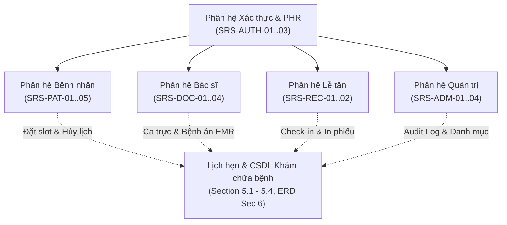

# SỔ TAY TỔNG HỢP NGUỒN LỰC QA, ĐẶC TẢ SRS, KẾ HOẠCH & QUY ƯỚC DỰ ÁN
**Dự án:** Hệ thống Quản lý & Đặt lịch Khám chữa bệnh (E-Healthcare Portal)  
**Tài liệu tham chiếu gốc:** [SRS-EHEALTH-2026-V1.docx](file:///d:/Intern/E-healthcare/docs/SRS-EHEALTH-2026-V1.docx) | [cautruc.md](file:///d:/Intern/E-healthcare/cautruc.md) | [ke-hoach-bo-sung-tasks-srs.md](file:///d:/Intern/E-healthcare/docs/ke-hoach-bo-sung-tasks-srs.md)  
**Đối tượng sử dụng:** Technical Lead, QA Engineer, Developer, System Analyst  
**Cập nhật lần cuối:** 27/09/2026  

---

## MỤC LỤC
1. [Bản đồ Tài liệu Nguồn & Căn cứ Pháp lý / Kỹ thuật](#1-bản-đồ-tài-liệu-nguồn--căn-cứ-pháp-lý--kỹ-thuật)
2. [Quy chuẩn Kiến trúc & Nguyên tắc Vận hành Dự án](#2-quy-chuẩn-kiến-trúc--nguyên-tắc-vận-hành-dự-án)
3. [Bản đồ Phân hệ Nghiệp vụ & Mã Đặc tả SRS](#3-bản-đồ-phân-hệ-nghiệp-vụ--mã-đặc-tả-srs)
4. [Bảng Phân công Công việc & Tiến độ Chi tiết (Sprint 1 - 4)](#4-bảng-phân-công-công-việc--tiến-độ-chi-tiết-sprint-1---4)
5. [Kho Báo cáo Kỹ thuật, Danh mục Lỗi & Biên bản Bàn giao](#5-kho-báo-cáo-kỹ-thuật-danh-mục-lỗi--biên-bản-bàn-giao)
6. [Sổ tay Lệnh Kiểm thử & Hướng dẫn Thực thi QA Toàn diện](#6-sổ-tay-lệnh-kiểm-thử--hướng-dẫn-thực-thi-qa-toàn-diện)
7. [Bảng Tra cứu Nhanh theo Card Task & Tiêu chí Nghiệm thu (DOD)](#7-bảng-tra-cứu-nhanh-theo-card-task--tiêu-chí-nghiệm-thu-dod)

---

## 1. BẢN ĐỒ TÀI LIỆU NGUỒN & CĂN CỨ PHÁP LÝ / KỸ THUẬT

| STT | Tài liệu / Nguồn | Đường dẫn tệp | Mục đích & Nội dung chính |
| :---: | :--- | :--- | :--- |
| 1 | **SRS Baseline 2026 V1** | [SRS-EHEALTH-2026-V1.docx](file:///d:/Intern/E-healthcare/docs/SRS-EHEALTH-2026-V1.docx) | Đặc tả yêu cầu phần mềm gốc (Toàn bộ Section 1 đến Section 8). |
| 2 | **Cấu trúc Thư mục & Nguyên tắc** | [cautruc.md](file:///d:/Intern/E-healthcare/cautruc.md) | Cấu trúc Monorepo, Tech stack, Coding convention, Naming rules. |
| 3 | **Kế hoạch Phân công 4 Sprint** | [Kế hoạch Phân công Dự án EHealth (SRS-EHEALTH-2026-V1).xlsx](file:///d:/Intern/E-healthcare/docs/K%E1%BA%BF%20ho%E1%BA%A1ch%20Ph%C3%A2n%20c%C3%B4ng%20D%E1%BB%B1%20%C3%A1n%20EHealth%20(SRS-EHEALTH-2026-V1).xlsx) | Bảng phân chia công việc gốc theo WBS của toàn bộ dự án. |
| 4 | **Ma trận Truy vết Yêu cầu (RTM)** | [RTM_Traceability_Matrix.xlsx](file:///d:/Intern/E-healthcare/docs/RTM_Traceability_Matrix.xlsx) | Ma trận liên kết giữa SRS ID, Test Case ID và Mã nguồn. |
| 5 | **Sơ đồ CSDL Thực thể Quan hệ** | [ERD_Logical_Physical.png](file:///d:/Intern/E-healthcare/docs/ERD_Logical_Physical.png) | Sơ đồ ERD thực thể Logical & Physical (Section 6.1). |
| 6 | **Kế hoạch Bổ sung Tasks (Sprint 3 & 4)** | [ke-hoach-bo-sung-tasks-srs.md](file:///d:/Intern/E-healthcare/docs/ke-hoach-bo-sung-tasks-srs.md) | Rà soát khoảng hụt (Gap Analysis), chi tiết 14 card bổ sung (Card 3.6 - Card 4.8). |
| 7 | **Báo cáo Rà soát Lỗ hổng Kỹ thuật** | [bao-cao-ra-soat-lan-cuoi-thieu-sot-srs.md](file:///d:/Intern/E-healthcare/docs/bao-cao-ra-soat-lan-cuoi-thieu-sot-srs.md) | Đối chiếu tính năng còn thiếu, phân loại rủi ro nghiệp vụ và kiến trúc. |

---

## 2. QUY CHUẨN KIẾN TRÚC & NGUYÊN TẮC VẬN HÀNH DỰ ÁN

### 2.1. Bộ Công nghệ Chuẩn (Technology Stack)
- **Frontend Client:** Angular 18 (Standalone Components, Signals, Reactive Forms, SCSS, TailwindCSS).
- **Backend Server:** NestJS 10 / 11 (Modular Architecture, TypeORM, Class-Validator, Guards, Interceptors).
- **Cơ sở dữ liệu:** PostgreSQL 16 (Hỗ trợ extension `pgcrypto` cho hàm mã hóa AES-256).
- **Bộ nhớ đệm & Hàng đợi:** Redis 7.2 (Cache, Socket.io Redis Adapter, BullMQ message queue, Distributed Lock).
- **Môi trường & Ảo hóa:** Docker Compose, Nginx TLS 1.3 reverse proxy (Rate limit 60 req/min theo NFR-SEC-03).
- **Dùng chung (Shared):** Monorepo workspace `@ehealth/shared` định nghĩa Enum, DTO, Interface dùng chung giữa Client & Server.

### 2.2. Quy ước Đặt tên Nhánh & Commit (Git Hygiene)
- **Branch Naming:**
  - `feature/<srs-code>-<short-description>` (Ví dụ: `feature/SRS-PAT-04-cancel-appointment-refund`, `feature/emr-addendum`).
  - `fix/<short-description>` (Ví dụ: `fix/appointment-lifecycle-refactor`).
- **Commit Message (Conventional Commits):**
  - Cú pháp: `<type>(<scope>): <short summary>`
  - Các loại: `feat`, `fix`, `docs`, `test`, `refactor`, `chore`.
  - Ví dụ: `feat(patient): implement appointment history and cancellation UI`, `fix(patient): align refund calculation boundary`.
- **Nguyên tắc tích hợp:** Ưu tiên `git rebase origin/develop` để giữ lịch sử tuyến tính. Nếu merge conflict, phải resolve cẩn trọng và chạy full test suite trước khi commit.

### 2.3. Quy định Phân quyền Người dùng (RBAC Matrix)
| Vai trò (`Role`) | Mã Enum | Prefix Tuyến đường | Mục đích |
|---|---|---|---|
| **Bệnh nhân** | `ROLE_PATIENT` | `/patient/*` | Tìm bác sĩ, đặt khám, xem lịch sử, tự hủy lịch, quản lý PHR. |
| **Bác sĩ** | `ROLE_DOCTOR` | `/doctor/*` | Đăng ký ca trực, hàng đợi khám, buồng khám EMR, lập phụ lục. |
| **Lễ tân** | `ROLE_RECEPTIONIST` | `/receptionist/*` | Tiếp đón check-in QR, đặt khám vãng lai, thu ngân, in phiếu nhiệt POS. |
| **Quản trị viên** | `ROLE_ADMIN` | `/admin/*` | Dashboard KPI, quản lý danh mục, chứng chỉ hành nghề, nhật ký kiểm toán. |

### 2.4. Tiêu chuẩn Hoàn thành (Definition of Done - DOD)
Một task hoặc PR chỉ được coi là hoàn tất khi:
1. Đáp ứng 100% checklist theo mã SRS quy định.
2. `npm test --workspace=ehealth-web-client` pass 100% (Client unit tests).
3. `npm run test --workspace=@ehealth/server` pass 100% (Server unit tests).
4. `npm run lint` đạt 0 lỗi (Clean).
5. `npm run build` thành công cho cả client và server.
6. Toàn bộ GitHub Actions CI checks chuyển sang trạng thái xanh (`pass`).

---

## 3. BẢN ĐỒ PHÂN HỆ NGHIỆP VỤ & MÃ ĐẶC TẢ SRS



### 3.1. Phân hệ Xác thực & Hồ sơ Sức khỏe Cá nhân (SRS-AUTH)
- **SRS-AUTH-01:** Đăng ký tài khoản bằng SĐT / Email kèm mã OTP xác thực (6 ký tự, hiệu lực 5 phút).
- **SRS-AUTH-02:** Đăng nhập an toàn (Argon2id/Bcrypt, Access Token 15 phút in-memory, Refresh Token 7 ngày trong HttpOnly Cookie) & Đăng nhập Google OAuth2 / ID Token.
- **SRS-AUTH-03:** Hồ sơ sức khỏe cá nhân (PHR) với khai báo nhóm máu, tiền sử bệnh mãn tính, dị ứng thuốc và đồng thuận xử lý dữ liệu y tế (Nghị định 13/2023/NĐ-CP).

### 3.2. Phân hệ Bệnh nhân (SRS-PAT)
- **SRS-PAT-01:** Tìm kiếm Bác sĩ đa tiêu chí (chuyên khoa, giá khám, xếp hạng, tìm kiếm toàn văn không dấu).
- **SRS-PAT-02:** Quy trình đặt khám chuẩn 4 bước kèm cơ chế khóa giữ slot phân tán Redis Lua Script (TTL 10 phút, Section 5.1).
- **SRS-PAT-03:** Thanh toán trực tuyến tích hợp MoMo / VNPay & mã hóa đơn QR.
- **SRS-PAT-04:** Lịch sử khám bệnh, xem phiếu hẹn có mã QR & Giao diện tự hủy lịch minh bạch hoàn tiền 100/70/0% (Section 5.3).
- **SRS-PAT-05:** Thông báo đa kênh (Email nhắc hẹn 24h, SMS nhắc hẹn 2h qua BullMQ, Section 7.1).

### 3.3. Phân hệ Bác sĩ (SRS-DOC)
- **SRS-DOC-01:** Khai báo và quản lý ca trực tuần (ca sáng, ca chiều, chia slot 15-30 phút).
- **SRS-DOC-02:** Hàng đợi bệnh nhân theo thời gian thực (Realtime WebSocket Socket.io).
- **SRS-DOC-03:** Buồng khám điện tử (EMR): Ghi nhận chỉ số sinh tồn (vitals), chẩn đoán mã ICD-10, kê đơn thuốc và Cơ chế Phụ lục Bệnh án (EMR Addendum) sau khóa 24h (Section 5.4, TT 46/2018/TT-BYT).
- **SRS-DOC-04:** Cảnh báo tương tác thuốc và dị ứng thuốc tự động (Popup cảnh báo đỏ mức độ nguy hiểm).

### 3.4. Phân hệ Lễ tân (SRS-REC)
- **SRS-REC-01:** Quầy tiếp đón: Quét mã QR check-in trong vòng 5 giây, tạo lịch cho khách vãng lai, in phiếu tiếp đón nhiệt POS K80 / Laser A5 (Section 3.2).
- **SRS-REC-02:** Bảng hàng đợi gọi số ngoài sảnh chờ Fullscreen TV kèm âm thanh thông báo (Section 3.4).

### 3.5. Phân hệ Quản trị (SRS-ADM)
- **SRS-ADM-01:** Dashboard KPI doanh thu, công suất phòng khám, tỷ lệ hủy/no-show.
- **SRS-ADM-02:** Quản lý danh mục chuyên khoa, danh mục thuốc quốc gia, biểu phí.
- **SRS-ADM-03:** Quản lý nhân sự y tế & chứng chỉ hành nghề (CCHN).
- **SRS-ADM-04:** Tra cứu nhật ký kiểm toán bất biến (Append-only Audit Logs).

---

## 4. BẢNG PHÂN CÔNG CÔNG VIỆC & TIẾN ĐỘ CHI TIẾT (SPRINT 1 - 4)

### 4.1. Đội ngũ Phụ trách Dự án
1. **Lê Việt Cường:** Technical Lead / DevOps / Kiến trúc Hạ tầng & Backend.
2. **Nguyễn Mạnh Thi:** Frontend Lead / In ấn POS K80 / Đánh giá phản hồi Bác sĩ.
3. **Trần Văn Tiến:** Frontend Developer / Ca trực Bác sĩ / Đặt lịch / Hủy lịch khám.
4. **Đồng Văn Tú:** Backend Developer / Máy trạng thái Lịch hẹn / Xác thực OAuth & PHR.
5. **Nguyễn Văn Tùng:** Fullstack Developer / Buồng khám EMR / Phụ lục bệnh án Addendum.
6. **Trần Trọng Hoàn:** Frontend Developer / TV Queue Board Sảnh chờ / Audit Logs UI.

### 4.2. Bảng Phân bổ Chi tiết các Card Nhiệm vụ

| Mã Card | Tên Task / Nội dung Nghiệp vụ | Căn cứ SRS | Thành viên | Nhánh Git / PR | File trọng tâm |
|---|---|---|---|---|---|
| **Card 1.1** | Khung Kiến trúc Monorepo & Base UI/BE | Section 1..3, `cautruc.md` | Lê Việt Cường | `feature/client-architecture` | `shared/`, `client/src/app/core/`, `server/src/main.ts` |
| **Card 1.2** | Đăng ký tài khoản & Xác thực OTP SĐT/Email | SRS-AUTH-01 | Đồng Văn Tú | `feature/srs-auth-01-registration` | `server/src/modules/auth/`, `client/.../register/` |
| **Card 1.3** | Đăng nhập JWT, Google OAuth & RBAC Guards | SRS-AUTH-02 | Đồng Văn Tú | `feature/2.2-auth-phr-ui` | `client/.../auth.guard.ts`, `server/.../auth.service.ts` |
| **Card 1.4** | Hồ sơ sức khỏe cá nhân (PHR) & Dị ứng | SRS-AUTH-03 | Trần Văn Tiến | `feature/2.2-auth-phr-ui` | `client/.../phr-profile/`, `server/.../phr/` |
| **Card 2.1** | Tìm kiếm bác sĩ, chuyên khoa & bộ lọc | SRS-PAT-01 | Trần Văn Tiến | `feature/srs-doc-01-and-srs-pat-01` | `client/.../doctor-search/`, `server/.../doctor/` |
| **Card 2.2** | Quy trình đặt khám 4 bước & khóa slot Redis | SRS-PAT-02, Sec 5.1 | Tiến & Cường | `feature/srs-pat-02-distributed-slot-locking` | `client/.../booking-stepper/`, `server/.../booking.service.ts` |
| **Card 2.3** | Kiểm thử tải tranh chấp 100 CCU slot | NFR-PERF-01 | Lê Việt Cường | `feature/card-2.6-slot-concurrency-test` | `tests-load/k6-slot-concurrency.js` |
| **Card 3.1** | Máy trạng thái Vòng đời Lịch hẹn & Hoàn tiền | Section 5.2 & 5.3 | Đồng Văn Tú | PR #19 (`feature/appointment-status...`) | `server/.../appointment-lifecycle.service.ts` |
| **Card 3.2** | Quầy tiếp đón Lễ tân check-in QR & Khách vãng lai | SRS-REC-01 | Nguyễn Mạnh Thi | PR #22 (`feature/SRS-REC-01-02...`) | `client/.../checkin-desk/`, `server/.../reception/` |
| **Card 3.3** | Hàng đợi Bệnh nhân Buồng khám Realtime WS | SRS-DOC-02 | Nguyễn Văn Tùng | PR #21 (`feature/srs-doc-02-04...`) | `server/.../queue.gateway.ts`, `client/.../patient-queue/` |
| **Card 3.4** | Buồng khám EMR: Vitals, ICD-10, Kê đơn | SRS-DOC-03, 04 | Nguyễn Văn Tùng | PR #24 (`feature/3.3-emr-prescription`) | `client/.../consultation/`, `server/.../clinical/` |
| **Card 3.5** | [SRS-DOC & REC] Kiểm thử Chu trình Khám Lâm sàng & Cảnh báo Dị ứng Thuốc | SRS-DOC-02..04, SRS-REC-01, Sec 3.4 & 5.4, TT 52/2017 & TT 46/2018 | Lê Việt Cường | `feature/card-3.5-clinical-workflow-allergy-test` | `server/test/clinical-drug-safety.spec.ts`, `server/test/clinical-workflow-e2e.spec.ts`, `consultation.page.spec.ts`, `allergy-alert-modal.component.spec.ts`, `patient-queue.page.spec.ts` |
| **Card 3.6** | UI Khai báo & Quản lý Ca trực Bác sĩ | SRS-DOC-01 | Trần Văn Tiến | PR #25 (`feature/SRS-DOC-01-doctor-schedule`) | `client/.../schedule-config/` |
| **Card 3.7** | Quên mật khẩu OTP, Token Blacklist & PHR API | SRS-AUTH-01..03 | Đồng Văn Tú | `feature/auth-password-reset-phr` | `server/.../password-reset.service.ts` |
| **Card 3.8** | Màn hình Bảng gọi số Sảnh chờ Fullscreen TV | Section 3.4, SRS-REC-01 | Trần Trọng Hoàn | PR #30 (`feature/card-3.8-queue-board-integration`) | `client/.../queue-board/` |
| **Card 3.9** | Mẫu in phiếu tiếp đón POS K80 / Laser A5 | Section 3.2, SRS-REC-01 | Nguyễn Mạnh Thi | PR #27 (`feature/SRS-REC-01-print-integration`) | `client/.../print-receipt/`, `client/.../escpos-printer.service.ts` |
| **Card 3.10** | Phụ lục Bệnh án Điện tử (EMR Addendum) sau 24h | Section 5.4, SRS-DOC-03 | Nguyễn Văn Tùng | PR #29 (`feature/emr-addendum`) | `server/.../clinical-addendum.spec.ts`, `consultation.page.ts` |
| **Card 3.11** | Bệnh nhân Tự hủy lịch & Minh bạch Hoàn tiền 100/70/0% | Section 5.3, SRS-PAT-04 | Tú & Tiến (Lead fix) | PR #28 (`feature/SRS-PAT-04-cancel-appointment-refund`) | `client/.../medical-history/`, `server/.../appointment.controller.ts` |
| **Card 3.12** | Hạ tầng BullMQ Message Queue & Cron Schedulers | Section 7.1, SRS-PAT-05 | Lê Việt Cường | PR #18 (`feature/card-3.12-bullmq-cron`) | `server/.../bullmq/`, `server/.../appointment-cron.service.ts` |
| **Card 3.13** | UI Tra cứu Nhật ký Kiểm toán (Audit Logs) | SRS-ADM-04 | Trần Trọng Hoàn | PR #31 (`feature/card-3.13-audit-logs-ui`) | `client/.../admin/pages/audit-logs/` |
| **Card 3.14** | Đánh giá 1-5 sao & Nhận xét Bác sĩ sau khám | SRS-PAT-01, Table 7 | Nguyễn Mạnh Thi | Sprint 3 / Sprint 4 | `client/.../doctor-review/` |

---

## 5. KHO BÁO CÁO KỸ THUẬT, DANH MỤC LỖI & BIÊN BẢN BÀN GIAO

Khi QA hoặc Debug từng phân hệ, tra cứu các tài liệu chuyên sâu tương ứng:

### 5.1. Báo cáo Bàn giao & Kỹ thuật
- **Báo cáo Nghiệm thu Chu trình Khám & Dị ứng Thuốc (Card 3.5):** [bao-cao-nghiem-thu-card-3.5-chu-trinh-kham-va-canh-bao-di-ung.md](file:///d:/Intern/E-healthcare/docs/bao-cao-nghiem-thu-card-3.5-chu-trinh-kham-va-canh-bao-di-ung.md)
- **Báo cáo Hủy lịch & Hoàn tiền (PAT-04):** [bao-cao-SRS-PAT-04-cancel-appointment-refund.md](file:///d:/Intern/E-healthcare/docs/bao-cao-SRS-PAT-04-cancel-appointment-refund.md)
- **Báo cáo Phụ lục Bệnh án (EMR Addendum):** [Bao_Cao_EMR_Addendum.docx](file:///d:/Intern/E-healthcare/docs/Bao_Cao_EMR_Addendum.docx)
- **Báo cáo Hạ tầng BullMQ & Cron (Card 3.12):** [bao-cao-card-3.12-bullmq-cron-schedulers.md](file:///d:/Intern/E-healthcare/docs/bao-cao-card-3.12-bullmq-cron-schedulers.md)
- **Báo cáo Khóa slot phân tán Redis Lua (PAT-02):** [bao-cao-SRS-PAT-02-distributed-slot-locking.md](file:///d:/Intern/E-healthcare/docs/bao-cao-SRS-PAT-02-distributed-slot-locking.md)
- **Báo cáo Xếp lịch & Tìm kiếm Bác sĩ (DOC-01 & PAT-01):** [bao-cao-SRS-DOC-01-SRS-PAT-01.md](file:///d:/Intern/E-healthcare/docs/bao-cao-SRS-DOC-01-SRS-PAT-01.md)
- **Báo cáo Xác thực OTP, JWT & Google (AUTH):** [bao-cao-thuc-hien-xac-thuc.md](file:///d:/Intern/E-healthcare/docs/bao-cao-thuc-hien-xac-thuc.md)
- **Báo cáo Backend Lễ tân (REC-01 & 02):** [tong-hop-backend-SRS-REC-01-02-section-3-4.md](file:///d:/Intern/E-healthcare/docs/tong-hop-backend-SRS-REC-01-02-section-3-4.md)

### 5.2. Danh mục Lỗi (Defect Logs) & Yêu cầu Chuẩn hóa
- **Yêu cầu sửa lỗi In phiếu tiếp đón (PR #27):** [yeu-cau-sua-loi-pr-27-reception-print.md](file:///d:/Intern/E-healthcare/docs/yeu-cau-sua-loi-pr-27-reception-print.md)
- **QA & Smoke Test In ấn Lễ tân:** [reception-print-qa.md](file:///d:/Intern/E-healthcare/docs/reception-print-qa.md) & [reception-print-physical-smoke-test.md](file:///d:/Intern/E-healthcare/docs/reception-print-physical-smoke-test.md)
- **Chuẩn hóa Máy trạng thái Lịch hẹn (PR #19):** [yeu-cau-hoan-thien-pr-19-appointment-lifecycle.md](file:///d:/Intern/E-healthcare/docs/yeu-cau-hoan-thien-pr-19-appointment-lifecycle.md)
- **Bảng tổng hợp lỗi PAT-01 & PAT-02:** [bang-tong-hop-loi-SRS-PAT-01-02.md](file:///d:/Intern/E-healthcare/docs/bang-tong-hop-loi-SRS-PAT-01-02.md)
- **Bảng tổng hợp lỗi DOC-01 & PAT-01:** [bang-tong-hop-loi-SRS-DOC-01-SRS-PAT-01.md](file:///d:/Intern/E-healthcare/docs/bang-tong-hop-loi-SRS-DOC-01-SRS-PAT-01.md)
- **Biên bản bàn giao Lễ tân:** [reception-01-02-handoff.md](file:///d:/Intern/E-healthcare/docs/reception-01-02-handoff.md)
- **Báo cáo giải quyết Conflict PR #12:** [bao-cao-xu-ly-conflict-pr-12.md](file:///d:/Intern/E-healthcare/docs/bao-cao-xu-ly-conflict-pr-12.md)

---

## 6. SỔ TAY LỆNH KIỂM THỬ & HƯỚNG DẪN THỰC THI QA TOÀN DIỆN

### 6.1. Khởi động Môi trường Cục bộ
```powershell
# 1. Khởi động Angular Web Client (Cổng 4200, tích hợp proxy tới backend :3000)
cd d:\Intern\E-healthcare\client
npm start

# 2. Khởi động NestJS Backend Server (Cổng 3000)
cd d:\Intern\E-healthcare\server
npm run start:dev
```

### 6.2. Kiểm thử Nhanh bằng Thanh Dev Route Nav
Khi truy cập bất kỳ trang nào trên Client (`http://localhost:4200/`), thanh công cụ màu xám ở đầu trang cho phép giả lập phiên đăng nhập ngay lập tức:
- Click **"Patient"**: Tự động đăng nhập phiên Bệnh nhân $\rightarrow$ Truy cập `/patient/history`, `/patient/booking`.
- Click **"Doctor"**: Tự động đăng nhập phiên Bác sĩ $\rightarrow$ Truy cập `/doctor/schedule`, `/doctor/queue`, `/doctor/consultation`.
- Click **"Receptionist"**: Tự động đăng nhập phiên Lễ tân $\rightarrow$ Truy cập `/receptionist/checkin-desk`, `/receptionist/queue-board`.
- Click **"Admin"**: Tự động đăng nhập phiên Quản trị $\rightarrow$ Truy cập `/admin/dashboard`, `/admin/audit-logs`.

### 6.3. Bộ Lệnh Kiểm thử Tự động Toàn diện
```powershell
# Kiểm tra Unit Test toàn bộ Client (Chế độ Headless một lần, không treo watch)
npm test --workspace=ehealth-web-client -- --no-watch --browsers=ChromeHeadless

# Kiểm tra Unit Test toàn bộ Server (Chạy In-band không xung đột database/port)
npm run test --workspace=@ehealth/server

# Kiểm tra Cú pháp & Quy chuẩn Code (Linting toàn bộ Monorepo)
npm run lint

# Biên dịch toàn bộ Monorepo (Kiểm tra lỗi build Typescript/Angular/NestJS)
npm run build

# Kiểm thử Tải Xung đột Tranh chấp Slot (k6 giả lập 100 CCU)
k6 run tests-load/k6-slot-concurrency.js
```

---

## 7. BẢNG TRA CỨU NHANH THEO CARD TASK & TIÊU CHÍ NGHIỆM THU (DOD)

| Mã Card | URL màn hình QA | Hành vi Kiểm thử Cốt lõi | Tiêu chí Nghiệm thu Đạt chuẩn (Pass Criteria) |
|---|---|---|---|
| **Card 3.5** | `/doctor/consultation`, `/doctor/queue` | Chu trình khám lâm sàng & Cảnh báo dị ứng | - Quét QR check-in tiếp đón $\to$ realtime cập nhật hàng đợi khám.<br/>- Bật popup đỏ khi kê thuốc trùng nhóm dị ứng PHR.<br/>- Chặn đơn thuốc bệnh mạn tính $>30$ ngày (TT 52/2017/TT-BYT).<br/>- Khóa sau 24h và bắt buộc tạo EMR Addendum (TT 46/2018/TT-BYT). |
| **Card 3.6** | `/doctor/schedule` | Đăng ký ca trực tuần | - Chọn ngày, ca sáng/chiều, thời lượng slot 15/30m.<br/>- Danh sách ca trực hiển thị trực quan theo tuần. |
| **Card 3.7** | `/login`, `/profile` | Quên mật khẩu & PHR | - Nhập SĐT/Email $\rightarrow$ Nhận OTP $\rightarrow$ Đổi mật khẩu mới.<br/>- Đăng xuất thu hồi token trên Redis blacklist. |
| **Card 3.8** | `/receptionist/queue-board` | Bảng gọi số TV sảnh | - Chế độ toàn màn hình Fullscreen.<br/>- Realtime Socket.io nhảy số khám và phát âm thanh chuông. |
| **Card 3.9** | `/receptionist/checkin-desk` | In phiếu tiếp đón nhiệt | - In khổ K80 (80mm) và A5 Laser.<br/>- Có barcode/QR số thứ tự, phòng khám, họ tên. |
| **Card 3.10** | `/doctor/consultation` | Phụ lục Bệnh án sau 24h | - Ca khám $>24h$: Khóa chỉ đọc, hiện nhãn đỏ **"HỒ SƠ ĐÃ KHÓA 24H"**.<br/>- Nút **"Tạo Phụ lục Bệnh án"** cho phép thêm nội dung bổ sung. |
| **Card 3.11** | `/patient/history` | Tự hủy lịch & hoàn tiền | - $T \ge 24h$: Banner xanh, hoàn **100%**.<br/>- $2h \le T < 24h$: Banner vàng, hoàn **70%**.<br/>- $T < 2h$: Banner đỏ, hoàn **0%**.<br/>- Bắt buộc nhập lý do và tick checkbox đồng thuận. |
| **Card 3.12** | Background Server | BullMQ Queue & Cron | - Email và SMS nhắc hẹn được gửi ngầm qua hàng đợi Redis.<br/>- Cron tự động quét đánh dấu `NO_SHOW` sau 30 phút. |
| **Card 3.13** | `/admin/audit-logs` | Tra cứu Nhật ký Kiểm toán | - Chỉ có quyền Xem và Xuất CSV (Read-only, không nút sửa/xóa).<br/>- Bộ lọc theo thời gian, hành động, User ID, IP. |
